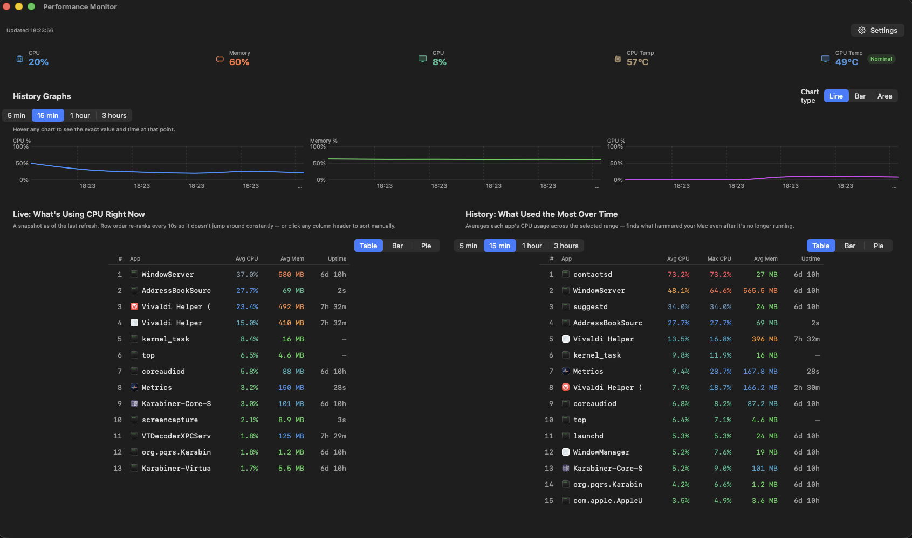
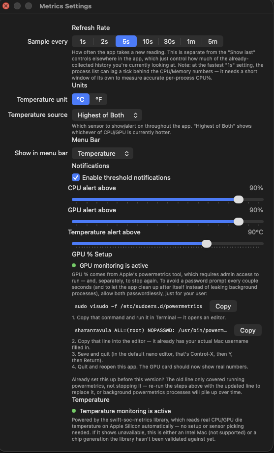
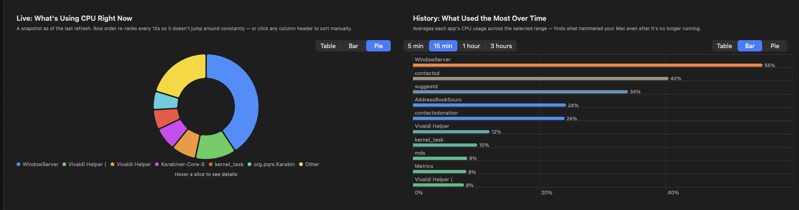

# Metrics App

A native macOS menu bar and dashboard app for real-time system performance monitoring — CPU, GPU, memory, temperature, and power, with historical charts and per-app breakdowns.

Built with SwiftUI for macOS 14+.

 

## Screenshots

**Dashboard** — live CPU/Memory/GPU/temperature tiles, history charts, and live + historical per-app tables side by side:



**Settings** — refresh rate, units, menu bar metric, notification thresholds, and the GPU % passwordless-sudo setup:



**Per-app views** — the same live/historical data as pie and bar charts, not just tables:



## Features

- **Live system metrics** — CPU %, Memory %, GPU %, CPU/GPU temperature, package power draw, and macOS's own Thermal Pressure state, all color-coded by severity (green → blue → orange → pink → red)
- **Menu bar presence** — pick any single metric to show in the menu bar; click for a full dropdown of everything at a glance, including the current top CPU consumer
- **History charts** — CPU/Memory/GPU over time, switchable between Line/Bar/Area, with a hover crosshair showing exact values, over 5 min / 15 min / 1 hour / 3 hour windows
- **Per-app breakdown** — a live "what's using CPU right now" table plus a "what hammered your Mac over the last hour" historical view, each viewable as a table, bar chart, or pie chart, with real app icons
- **Configurable refresh rate** — anywhere from 1 second to 5 minutes, live-adjustable without restarting
- **Threshold notifications** — set CPU/GPU/temperature limits; get notified when they're crossed, with a **Quit App** action right in the notification targeting the likely offending process
- **Sudoless real temperature and power** — via the [swift-soc-metrics](https://github.com/GoodOlClint/swift-soc-metrics) package, no admin password required
- **All settings persist** — refresh rate, chart windows, table view modes, thresholds, and more survive relaunches

## Requirements

- macOS 14 (Sonoma) or later
- Xcode 15+
- Apple Silicon Mac (temperature/power readings; CPU/RAM/process data works on any Mac)

## Setup

1. Clone this repo
2. Open in Xcode, or create a new macOS App project (SwiftUI, Swift) and add these source files
3. Add the package dependency: **File → Add Package Dependencies** → `https://github.com/GoodOlClint/swift-soc-metrics.git`, add the **SoCMetrics** library product to the target
4. In target settings → **Signing & Capabilities**, make sure **App Sandbox is off** (the app shells out to `top` and `powermetrics`, which sandboxing blocks)
5. Build & run

### Optional: enable GPU % (no password prompts)

GPU usage comes from Apple's `powermetrics`, which needs root. To avoid a password prompt every couple seconds, allow it to run passwordlessly for just your user:

```
sudo visudo -f /etc/sudoers.d/powermetrics
```

Add this line (replace with your actual macOS username, found via `whoami`):

```
yourusername ALL=(root) NOPASSWD: /usr/bin/powermetrics
```

Save and quit the editor, then relaunch the app. This is also available directly from the app's Settings screen, which shows this command pre-filled with your real username and a copy button.

## Project Structure

```
Metrics/
├── README.md
├── Metrics.xcodeproj/
└── Metrics/
    ├── PerfMonitorApp.swift        # app entry point (window + menu bar + settings scenes)
    ├── MonitorEngine.swift         # central sampling loop, publishes state, evaluates alerts
    ├── Models.swift                # data types
    ├── SettingsStore.swift         # persisted user settings
    │
    ├── SystemMetricsSampler.swift  # CPU/RAM via Mach host APIs
    ├── ProcessSampler.swift        # per-app CPU/RAM via `top`
    ├── PowerMetricsSampler.swift   # GPU % + thermal pressure via `powermetrics`
    ├── SMCReader.swift             # CPU/GPU temp + power via SoCMetrics package
    ├── HistoryStore.swift          # in-memory + on-disk history, with pruning
    ├── NotificationManager.swift   # threshold alerts with Quit App action
    ├── AppIconProvider.swift       # app icon lookup for the process tables
    ├── SeverityColor.swift         # green→blue→orange→pink→red color system
    │
    ├── DashboardView.swift         # main window UI
    ├── ChartsView.swift            # history charts
    ├── ProcessListView.swift       # live + historical per-app tables/charts
    ├── SettingsView.swift          # settings window
    ├── MenuBarView.swift           # menu bar label + dropdown
    │
    └── Assets.xcassets/
        └── AppIcon.appiconset/     # app icon (all required sizes + Contents.json)
```

## Known limitations

- **GPU % is system-wide, not per-app.** There's no per-process GPU breakdown in the tables — `powermetrics` can expose this via its `tasks` sampler, but it wasn't implemented here.
- **Temperature sensor coverage is CPU/GPU only.** Deeper sensor breadth (battery, trackpad, proximity sensors, etc., like TG Pro or iStat Menus show) would require a much larger reverse-engineered SMC key database that isn't publicly documented.
- **The menu bar text itself is monochrome.** macOS forces `MenuBarExtra` labels to render without custom color regardless of what's applied in SwiftUI — this is a platform constraint, not a bug. The dropdown menu, however, is fully colored.
- **`swift-soc-metrics` is a young, actively-developed dependency**, tracked on its `main` branch rather than a pinned version. It's reliable for personal use but worth keeping an eye on for updates.

## Acknowledgments

Real CPU/GPU temperature and power on Apple Silicon powered by [swift-soc-metrics](https://github.com/GoodOlClint/swift-soc-metrics).

## License

MIT License

Copyright (c) 2026 Sharan Ravula

Permission is hereby granted, free of charge, to any person obtaining a copy
of this software and associated documentation files (the "Software"), to deal
in the Software without restriction, including without limitation the rights
to use, copy, modify, merge, publish, distribute, sublicense, and/or sell
copies of the Software, and to permit persons to whom the Software is
furnished to do so, subject to the following conditions:

The above copyright notice and this permission notice shall be included in all
copies or substantial portions of the Software.

THE SOFTWARE IS PROVIDED "AS IS", WITHOUT WARRANTY OF ANY KIND, EXPRESS OR
IMPLIED, INCLUDING BUT NOT LIMITED TO THE WARRANTIES OF MERCHANTABILITY,
FITNESS FOR A PARTICULAR PURPOSE AND NONINFRINGEMENT. IN NO EVENT SHALL THE
AUTHORS OR COPYRIGHT HOLDERS BE LIABLE FOR ANY CLAIM, DAMAGES OR OTHER
LIABILITY, WHETHER IN AN ACTION OF CONTRACT, TORT OR OTHERWISE, ARISING FROM,
OUT OF OR IN CONNECTION WITH THE SOFTWARE OR THE USE OR OTHER DEALINGS IN THE
SOFTWARE.
